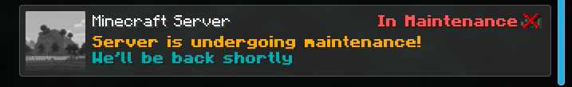
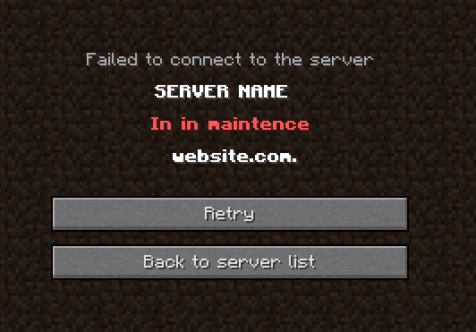

  

<table>
  <tr>
    <td>EN <a href="./README.md">English</a></td>
    <td>BR <a href="./br/README_BR.md">Português</a></td>
    <td>ES <a href="./es/README_ES.md">Español</a></td>
  </tr>
</table>

<h2>What does the plugin do?</h2>

A simple Minecraft plugin that allows you to change maintenance message to your Minecraft server's motd

  

 

  

<h2>Permissions:</h2>

<ul>
  <li><code>nekoMaintenance.commands</code> - Permission required to execute the command in Minecraft.</li>
  <li><code>nekoMaintenance.join</code> - Permission required to login the server with maintenance mode enabled.</li>
</ul>

<h2>Commands</h2>

<ul>
  <li><code>/maintenance on</code></li>
  <li><code>/maintenance off</code></li>
</ul>

<h2>Dependencies</h2>

<a href="https://www.spigotmc.org/resources/protocollib.1997/">ProtocolLib</a> (click here to download)

<h2>Tested Versions</h2>

<ul>
  <li>1.8.9</li>
  <li>1.9.4</li>
  <li>1.10.2</li>
  <li>1.12.2</li>
  <li>1.19.4</li>
</ul>

<h2>Patch Notes</h2>

<a href="./patch_notes.md">Here</a>

