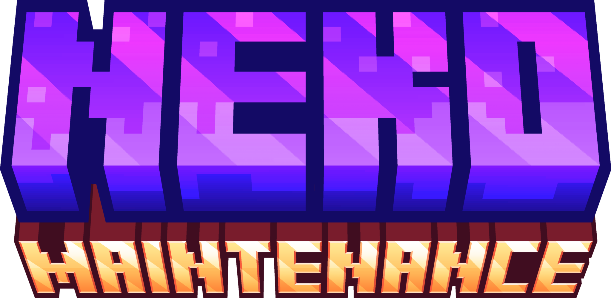
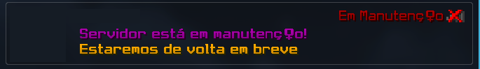
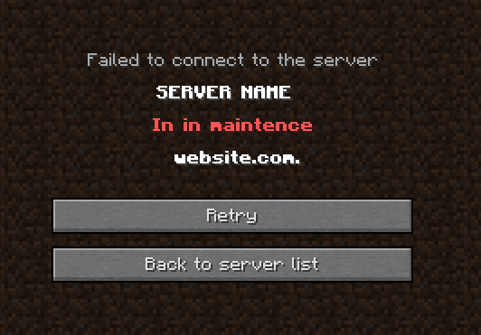

  

  <table>
    <tr>
      <td> <a href="../README.md">English</a></td>
      <td> <a href="../es/README_ES.md">Español</a></td>
      <td> <a href="./README_BR.md">Português</a></td>
    </tr>
  </table>

<h2>Oque o Plugin faz?</h2>

Um plugin simples para Minecraft que adiciona uma mensagem editável na modtag de manutenção ao seu servidor de Minecraft.

  

 

  

<h2>Permissões</h2>

<ul>
  <li><code>NekoMaintenance.commands</code> - Permissão necessária para executar o comando dentro do Minecraft..</li>
  <li><code>NekoMaintenance.join</code> - Permissão necessária para entrar no servidor em manuntenção.</li>
</ul>

<h2>Comandos</h2>

<ul>
  <li><code>/maintenance ativar</code></li>
  <li><code>/maintenance desativar</code></li>
</ul>

<h2>Dependencias</h2>

<a href="https://www.spigotmc.org/resources/protocollib.1997/">ProtocolLib</a> (clique para baixar)

<h2>Versões testadas</h2>

<ul>
  <li>1.8.9</li>
  <li>1.9.4</li>
  <li>1.10.2</li>
  <li>1.12.2</li>
  <li>1.19.4</li>
</ul>

<h2>Notas de atualização</h2>

<a href="./patch_notes_BR.md">Aqui</a>

