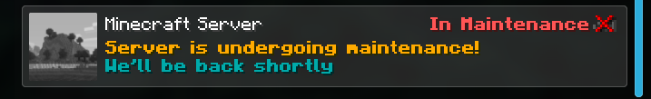

  

  <table>
    <tr>
      <td> <a href="../README.md">English</a></td>
      <td> <a href="./README_ES.md">Español</a></td>
      <td> <a href="../br/README_BR.md">Português</a></td>
    </tr>
  </table>

<h2>¿Qué hace el plugin?</h2>

Un plugin sencillo para Minecraft que agrega un mensaje en la lista de jugadores en mantenimiento a tu servidor de Minecraft.

  

 

  

<h2>Permissions:</h2>

<ul>
  <li><code>NekoMaintenance.commands</code> - Permiso necesario para ejecutar el comando dentro de Minecraft.</li>
  <li><code>NekoMaintenance.join</code> - Permiso necesario para unirse al servidor en mantenimiento.</li>
</ul>

<h2>Commands</h2>

<ul>
  <li><code>/maintenance activar</code></li>
  <li><code>/maintenance desactivar</code></li>
</ul>

<h2>Dependencias</h2>

<a href="https://www.spigotmc.org/resources/protocollib.1997/">ProtocolLib</a> (clic para descargar)

<h2>Tested Versions</h2>

<ul>
  <li>1.8.9</li>
  <li>1.9.4</li>
  <li>1.10.2</li>
  <li>1.12.2</li>
  <li>1.19.4</li>
</ul>

<h2>Notas de actualización</h2>

<a href="./patch_notes_ES.md">Here</a>

